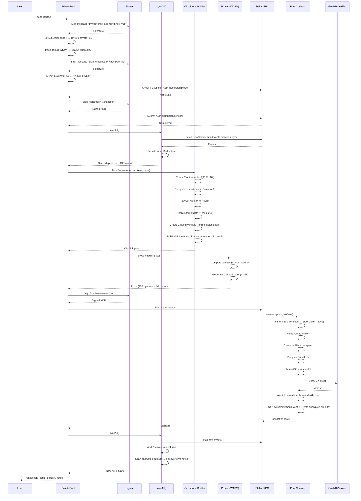

# Deposit Flow

## How it works

When a user calls `pool.deposit(100)`, this is what happens under the hood.

Note: key derivation and ASP registration happen once during `pool.initialize()`, not on every deposit. They're shown here for completeness.

### Step 1 — Key Derivation
The SDK asks the wallet (Signer) to sign two specific messages. These signatures are deterministic — the same wallet always produces the same signatures for the same messages. From these signatures, two keypairs are derived:
- **BN254 keypair** (spending key) — used inside ZK proofs to prove you own a note
- **X25519 keypair** (encryption key) — used to encrypt/decrypt note contents so only the owner can read them

These are completely different crypto systems serving different purposes. One signature can't do both jobs.

### Step 1.5 — Auto-Register (first time only)
The SDK checks if the user's public key is already in the ASP membership tree. If not, it submits a transaction to add it. This is required before the user can transact — every ZK proof must include a membership proof showing the user is in the approved set.

### Step 2 — Sync
Before doing anything, the SDK fetches the latest on-chain events (new commitments, new nullifiers) and rebuilds the local Merkle tree. This ensures we're working with the current pool state. If our local tree root doesn't match the on-chain root, any proof we generate will be rejected.

### Step 3 — Build Circuit Inputs
The CircuitInputBuilder constructs everything the ZK circuit needs:
- **Two output notes** — the deposit creates one note for the full amount and one zero-value dummy (circuit requires exactly 2 outputs). Each note is a commitment: `Poseidon2(amount, ownerPubKey, randomBlinding)`.
- **Two dummy inputs** — for a deposit, no existing notes are being spent, so the inputs are zeros. The circuit always expects 2-in 2-out.
- **Encrypted outputs** — each note's contents (amount + blinding) are encrypted with the owner's X25519 key, so only they can decrypt it later.
- **External data hash** — a Keccak256 hash of the public transaction data (recipient, amount, encrypted outputs). This binds the proof to this specific transaction — you can't reuse the proof with different parameters.
- **ASP proofs** — membership proof (you're in the approved set) and non-membership proof (you're not in the blocked set).

### Step 4 — Generate ZK Proof
The Prover takes the circuit inputs and runs them through two stages:
1. **Witness generation** — the Circom circuit WASM computes every intermediate value (all the wire values in the circuit)
2. **Proof generation** — the Groth16 prover takes the witness + proving key and produces a 256-byte proof

This proof says: "I know private values (amounts, keys, blindings) that satisfy all the circuit constraints (balance conservation, correct commitments, valid Merkle proofs, ASP compliance) — but I'm not revealing any of them."

### Step 5 — Submit Transaction
The SDK builds a Soroban transaction calling `Pool.transact(proof, extData)`, asks the Signer to sign it, and submits via RPC.

### Step 6 — On-Chain Verification
The Pool contract:
1. Takes the user's tokens ($100 transferred from user to pool)
2. Verifies the Merkle root in the proof matches a known historical root
3. Checks no nullifiers have been spent before (prevents double-spending)
4. Verifies the external data hash matches (prevents tampering)
5. Checks ASP roots match current on-chain state
6. Delegates proof verification to the Groth16 Verifier contract
7. Inserts the two new commitments into its Merkle tree
8. Emits events with the encrypted note data

### Step 7 — Post-Sync
The SDK syncs again to pick up the events from its own transaction. It adds the new commitments to the local Merkle tree and saves the notes locally. The user now has a private note they can spend later.

## Sequence Diagram

