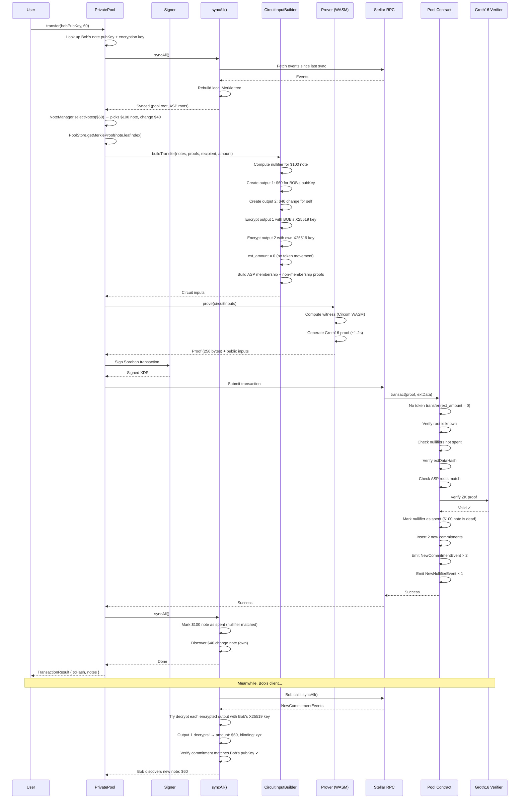

```mermaid
sequenceDiagram
    participant User
    participant Pool as PrivatePool
    participant Wallet as Signer
    participant Sync as syncAll()
    participant Builder as CircuitInputBuilder
    participant Prover as Prover (WASM)
    participant RPC as Stellar RPC
    participant Contract as Pool Contract
    participant Verifier as Groth16 Verifier

    User->>Pool: transfer(bobPubKey, 60)

    Pool->>Pool: Look up Bob's note pubKey + encryption key

    Pool->>Sync: syncAll()
    Sync->>RPC: Fetch events since last sync
    RPC-->>Sync: Events
    Sync->>Sync: Rebuild local Merkle tree
    Sync-->>Pool: Synced (pool root, ASP roots)

    Pool->>Pool: NoteManager.selectNotes($60) → picks $100 note, change $40
    Pool->>Pool: PoolStore.getMerkleProof(note.leafIndex)

    Pool->>Builder: buildTransfer(notes, proofs, recipient, amount)
    Builder->>Builder: Compute nullifier for $100 note
    Builder->>Builder: Create output 1: $60 for BOB's pubKey
    Builder->>Builder: Create output 2: $40 change for self
    Builder->>Builder: Encrypt output 1 with BOB's X25519 key
    Builder->>Builder: Encrypt output 2 with own X25519 key
    Builder->>Builder: ext_amount = 0 (no token movement)
    Builder->>Builder: Build ASP membership + non-membership proofs
    Builder-->>Pool: Circuit inputs

    Pool->>Prover: prove(circuitInputs)
    Prover->>Prover: Compute witness (Circom WASM)
    Prover->>Prover: Generate Groth16 proof (~1-2s)
    Prover-->>Pool: Proof (256 bytes) + public inputs

    Pool->>Wallet: Sign Soroban transaction
    Wallet-->>Pool: Signed XDR
    Pool->>RPC: Submit transaction

    RPC->>Contract: transact(proof, extData)
    Contract->>Contract: No token transfer (ext_amount = 0)
    Contract->>Contract: Verify root is known
    Contract->>Contract: Check nullifiers not spent
    Contract->>Contract: Verify extDataHash
    Contract->>Contract: Check ASP roots match
    Contract->>Verifier: Verify ZK proof
    Verifier-->>Contract: Valid ✓
    Contract->>Contract: Mark nullifier as spent ($100 note is dead)
    Contract->>Contract: Insert 2 new commitments
    Contract->>Contract: Emit NewCommitmentEvent × 2
    Contract->>Contract: Emit NewNullifierEvent × 1
    Contract-->>RPC: Success

    RPC-->>Pool: Success
    Pool->>Sync: syncAll()
    Sync->>Sync: Mark $100 note as spent (nullifier matched)
    Sync->>Sync: Discover $40 change note (own)
    Sync-->>Pool: Done
    Pool-->>User: TransactionResult { txHash, notes }

    Note over User, Verifier: Meanwhile, Bob's client...
    Sync->>RPC: Bob calls syncAll()
    RPC-->>Sync: NewCommitmentEvents
    Sync->>Sync: Try decrypt each encrypted output with Bob's X25519 key
    Sync->>Sync: Output 1 decrypts! → amount: $60, blinding: xyz
    Sync->>Sync: Verify commitment matches Bob's pubKey ✓
    Sync-->>Pool: Bob discovers new note: $60
```
