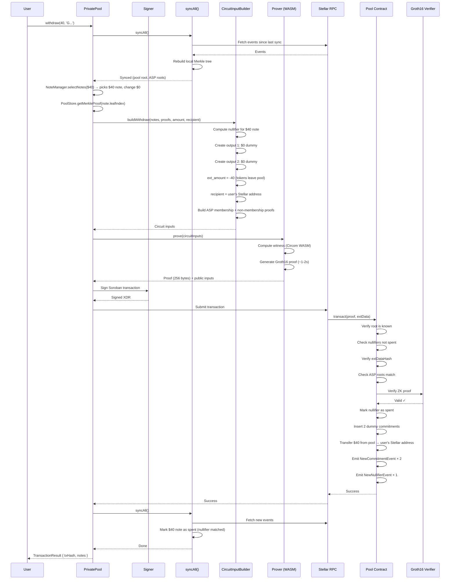

```mermaid
sequenceDiagram
    participant User
    participant Pool as PrivatePool
    participant Wallet as Signer
    participant Sync as syncAll()
    participant Builder as CircuitInputBuilder
    participant Prover as Prover (WASM)
    participant RPC as Stellar RPC
    participant Contract as Pool Contract
    participant Verifier as Groth16 Verifier

    User->>Pool: withdraw(40, 'G...')

    Pool->>Sync: syncAll()
    Sync->>RPC: Fetch events since last sync
    RPC-->>Sync: Events
    Sync->>Sync: Rebuild local Merkle tree
    Sync-->>Pool: Synced (pool root, ASP roots)

    Pool->>Pool: NoteManager.selectNotes($40) → picks $40 note, change $0
    Pool->>Pool: PoolStore.getMerkleProof(note.leafIndex)

    Pool->>Builder: buildWithdraw(notes, proofs, amount, recipient)
    Builder->>Builder: Compute nullifier for $40 note
    Builder->>Builder: Create output 1: $0 dummy
    Builder->>Builder: Create output 2: $0 dummy
    Builder->>Builder: ext_amount = -40 (tokens leave pool)
    Builder->>Builder: recipient = user's Stellar address
    Builder->>Builder: Build ASP membership + non-membership proofs
    Builder-->>Pool: Circuit inputs

    Pool->>Prover: prove(circuitInputs)
    Prover->>Prover: Compute witness (Circom WASM)
    Prover->>Prover: Generate Groth16 proof (~1-2s)
    Prover-->>Pool: Proof (256 bytes) + public inputs

    Pool->>Wallet: Sign Soroban transaction
    Wallet-->>Pool: Signed XDR
    Pool->>RPC: Submit transaction

    RPC->>Contract: transact(proof, extData)
    Contract->>Contract: Verify root is known
    Contract->>Contract: Check nullifiers not spent
    Contract->>Contract: Verify extDataHash
    Contract->>Contract: Check ASP roots match
    Contract->>Verifier: Verify ZK proof
    Verifier-->>Contract: Valid ✓
    Contract->>Contract: Mark nullifier as spent
    Contract->>Contract: Insert 2 dummy commitments
    Contract->>Contract: Transfer $40 from pool → user's Stellar address
    Contract->>Contract: Emit NewCommitmentEvent × 2
    Contract->>Contract: Emit NewNullifierEvent × 1
    Contract-->>RPC: Success

    RPC-->>Pool: Success
    Pool->>Sync: syncAll()
    Sync->>RPC: Fetch new events
    Sync->>Sync: Mark $40 note as spent (nullifier matched)
    Sync-->>Pool: Done
    Pool-->>User: TransactionResult { txHash, notes }
```
